# MegaTrueTrue

The incredible MegaTrueTrue robot but much bigger.
We have taken the newest educative Corean robot and and made it 8 times bigger.

This has been my first project with a big robot, with big engines, and a real functional structure.
It has been engendered with all custom hardware made in Complubot following a modular design in the software and in the hardware. Every part of the robot can be used separated from the rest as an autonomus module but combinning them all together they make this incredible robot.

## Where he has been:
MegaTrueTrue is an educational robot that has been traveling since it has been built. Firstly he has gone to the simo fair where he has meet the creator of their little brothers.

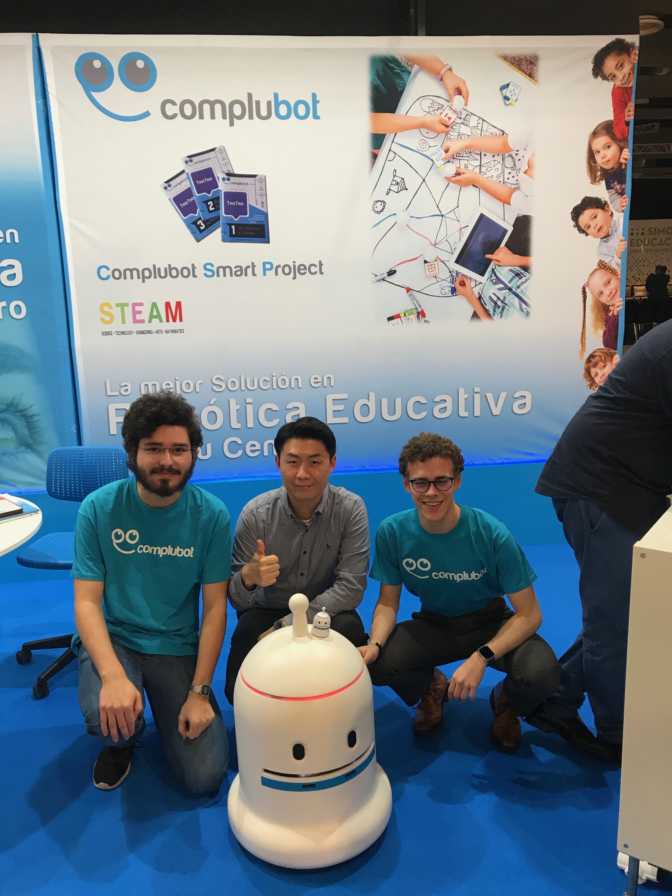

Right now he is traveling all around Spain to help childrends and teachers to learn robotics and programming in the most beautiful way :)
You can see its journey in the Complubot's Twitter : 
[Complubot](https://twitter.com/complubot?lang=es "Complubot")
[In the class](https://twitter.com/puerto/status/1068078335325028352 "In the class")
[The MegTrueTrue at Simo](https://twitter.com/TrueTrue_es/status/1062320200341733376 "The MegTrueTrue at Simo")

## What it can do:
* The MegaTrueTrue robot can be controlled with a mobile app where you can move it, make it play some preloaded songs and change its ring color.
* You can program it with cards to make a set of linear actions.
* He can detect people in fornt of him and stop near them and salute them with a beautiful song.

## How he does it:
* **Sound:** The robot has a dedicated sound board with dual speakers to play preloaded songs. In order to generate the sounds the board needs to crear a sine wave that is amplified and sent to two speakers that it has inside his head.
* **Movement:** MegaTrueTrue moves with a diferential motor configuration. In order to do thar he has motors with encoders and performs PID control to always know where hi is, and how much he has moved. Thanks to this we can move the robot always at a controlled speed with the movile app or always the same distance when it's been programmed with cards.
* **Read the cards:** In his moth there are two color sensors and some ldrs wich can infer the color of any object put inside the mouth so he can knows wich card it has in it and consequently he can perform our desired action.
* **Detect people:** Not runnig over people its one of the main goals of the MegaTrueTrue robot. He has two infrades sensors on his front to stop befor hiting anybody, he is fast but he is not harmful!!!

[Download for Android](https://play.google.com/store/apps/details?id=com.mrblissfulgrin.MegaTrueTrue "MegaTrueTrue App")

[Mr.BlissfulGrin](http://www.mrblissfulgrin.com "mrblissfulgrin")

## Some photos:

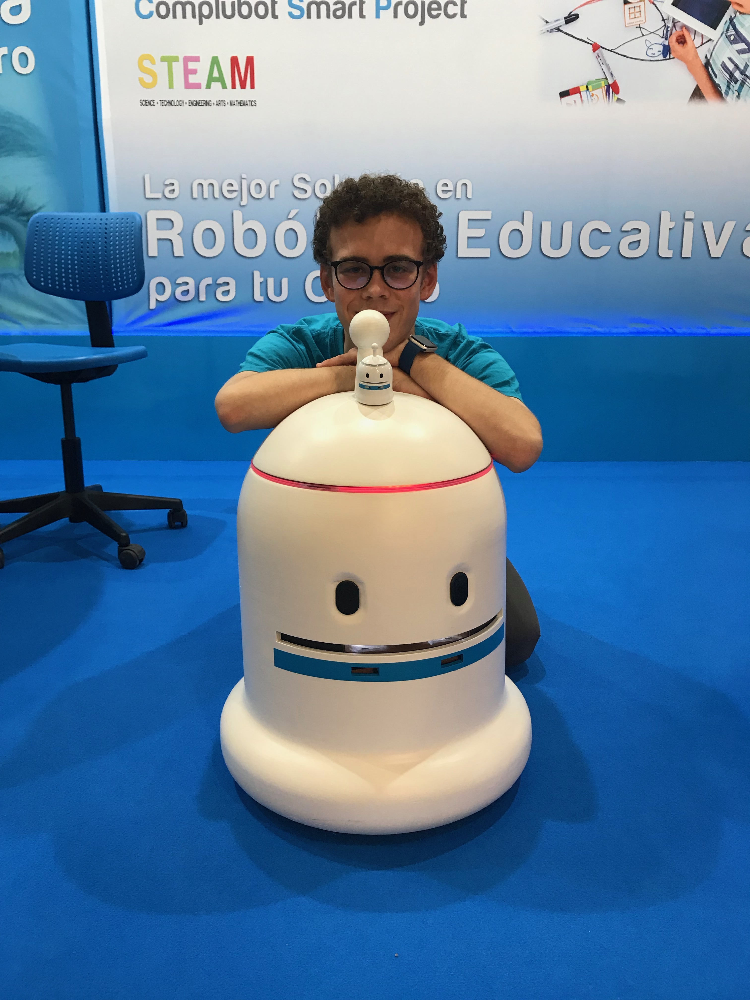
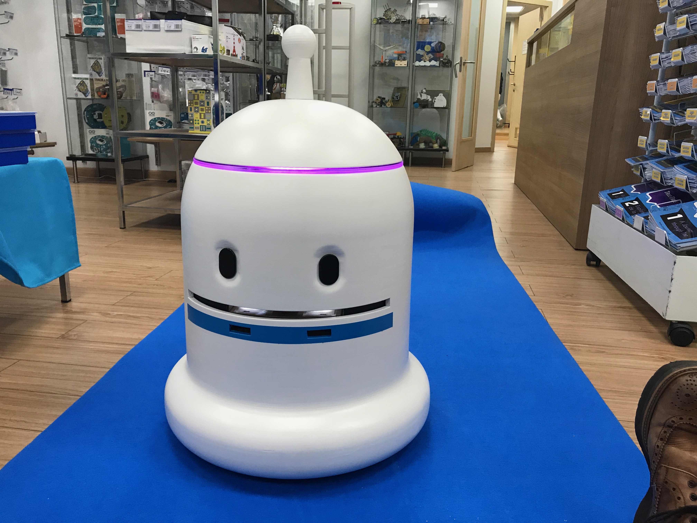
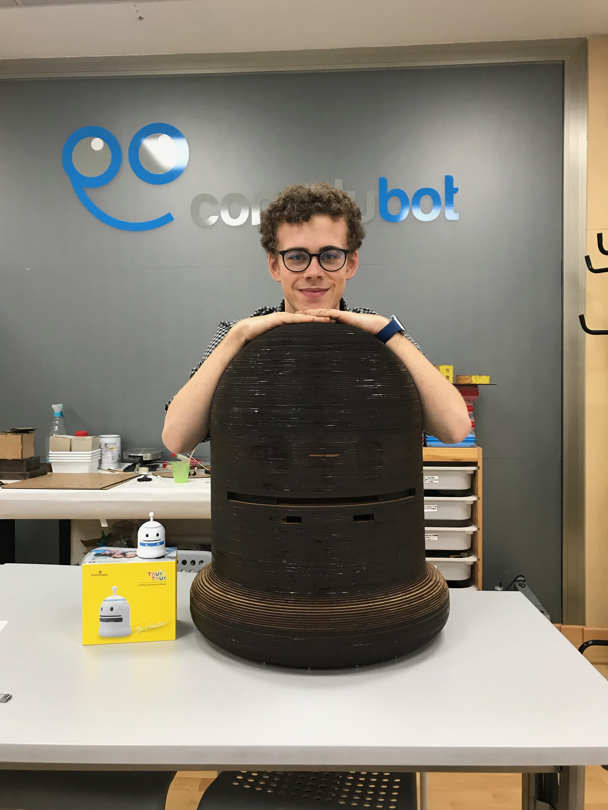
me
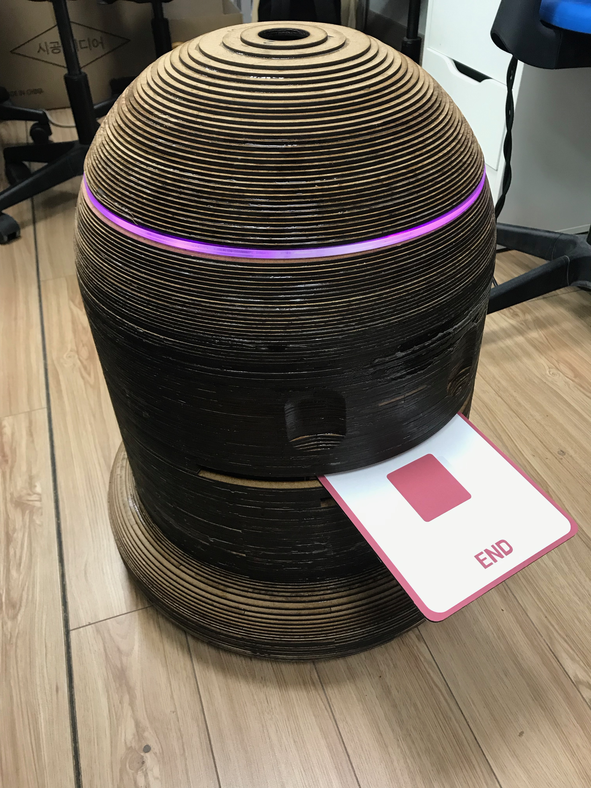
Afeter getting painted ;)
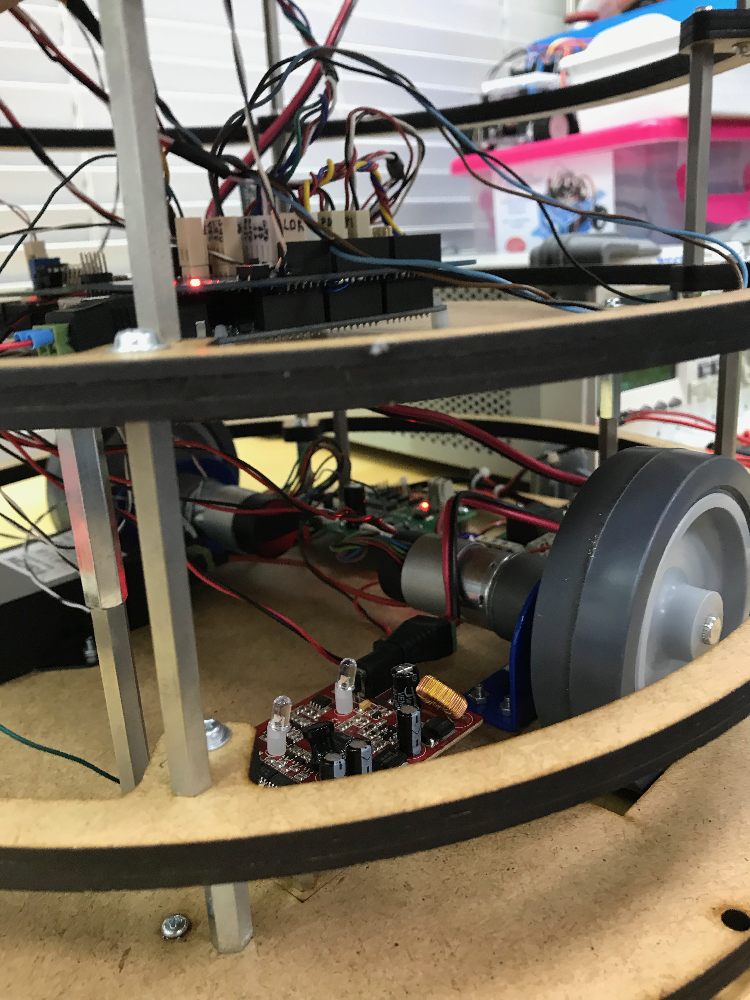
The motors
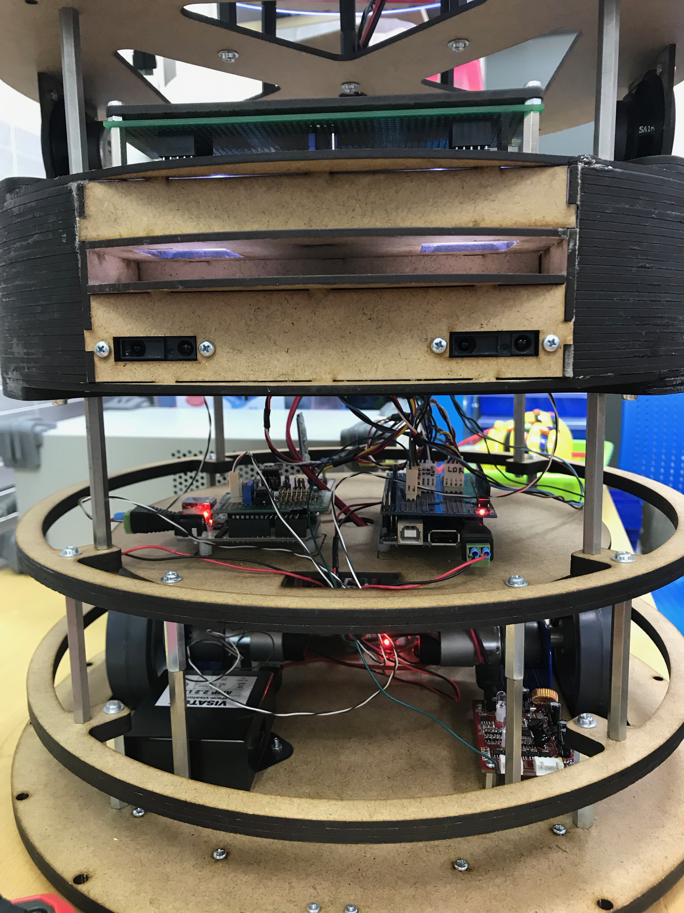
A hint of the modular design
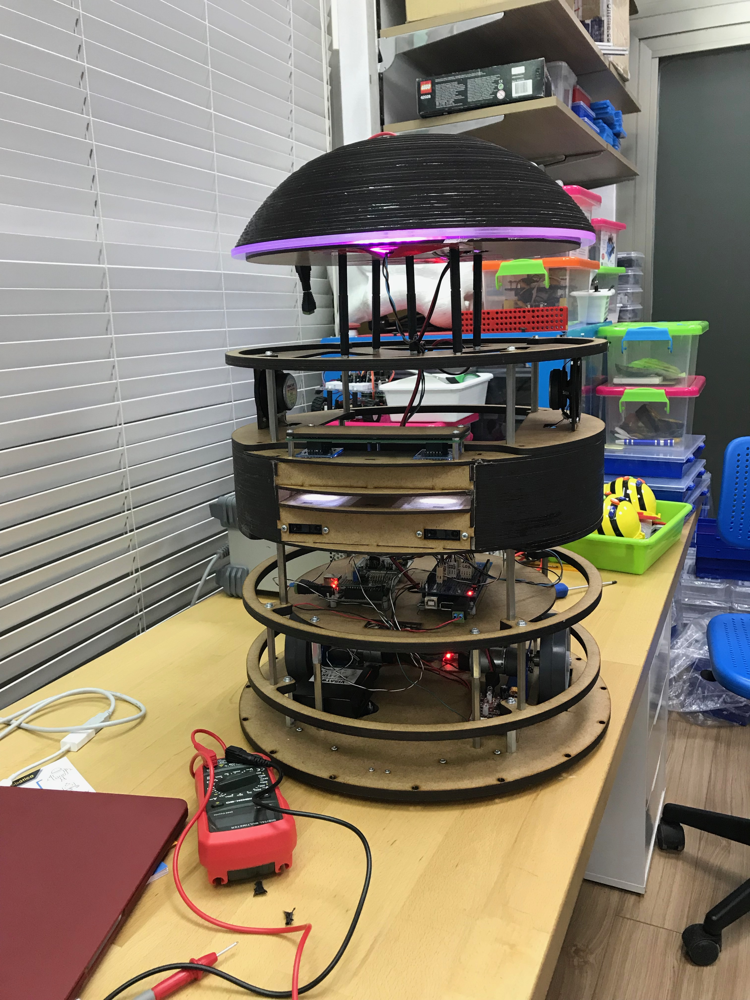
Bringing the light
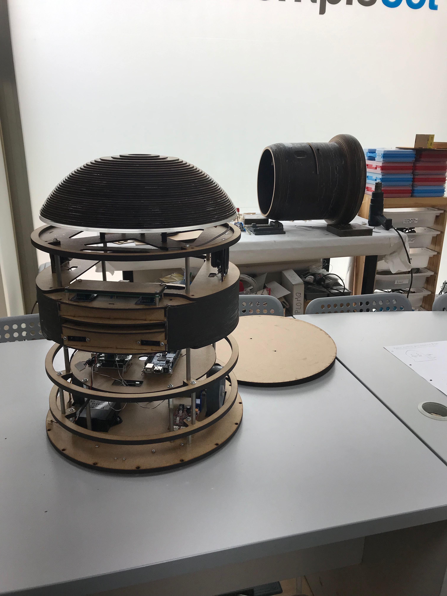
Withouth the body
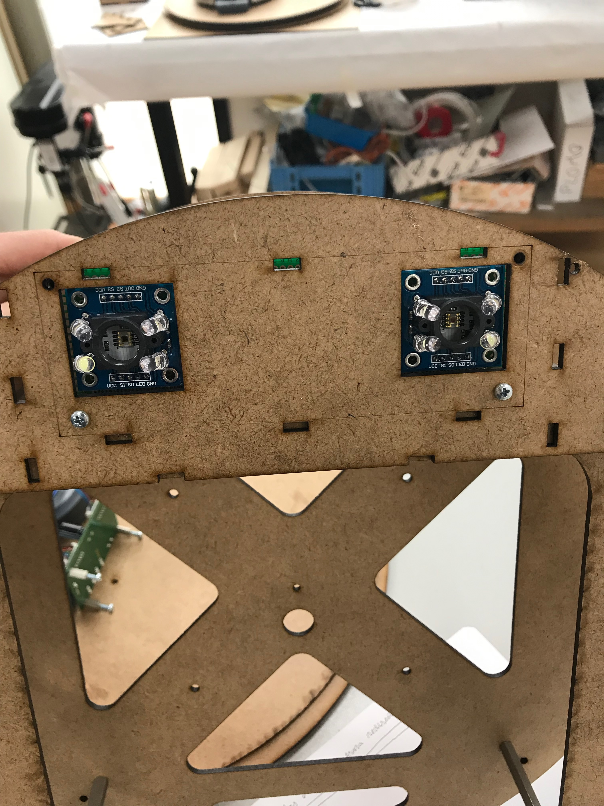
It can see U
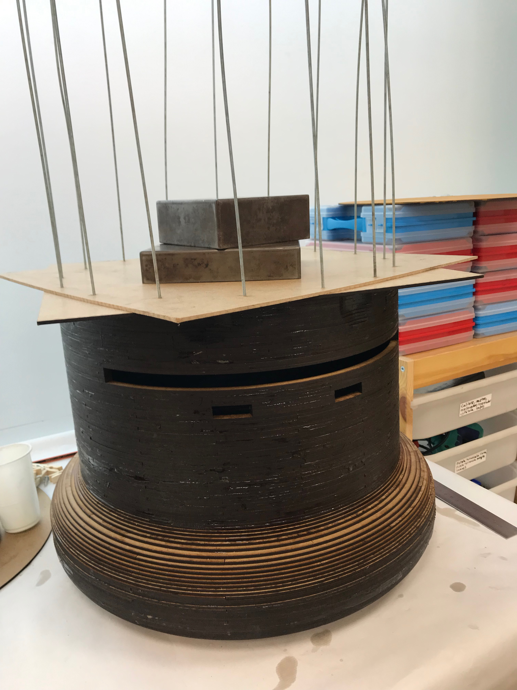
Half the body
